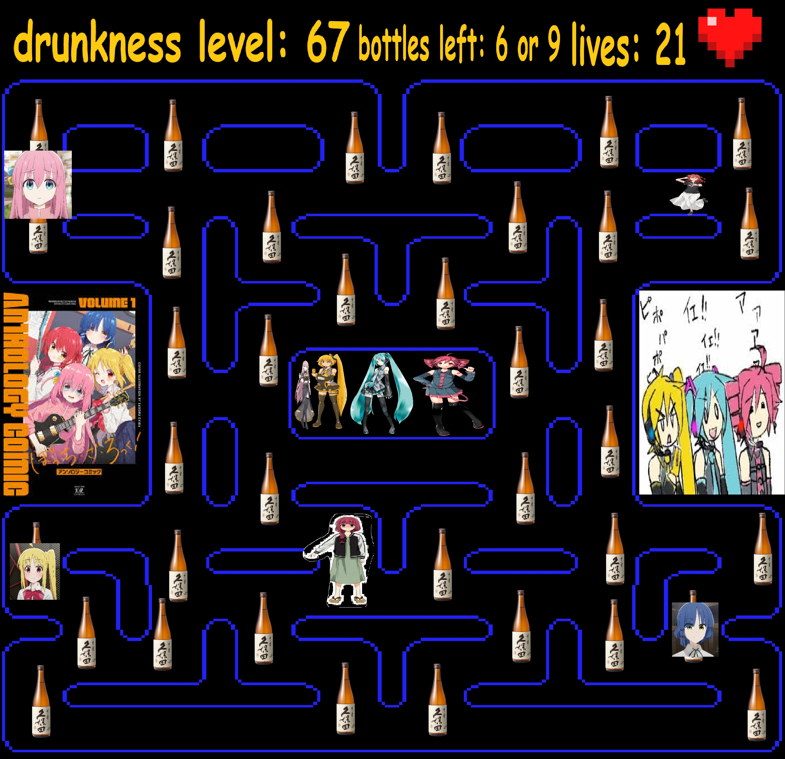
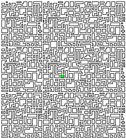
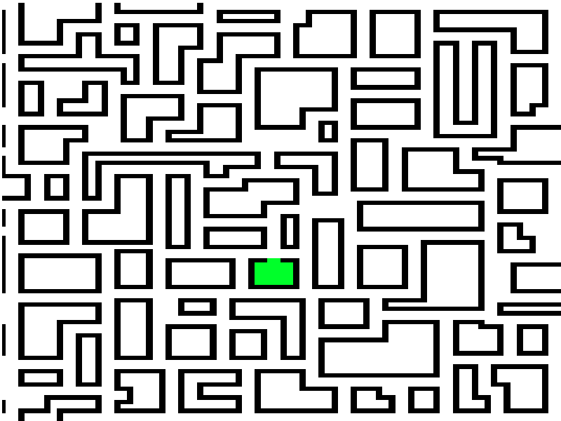
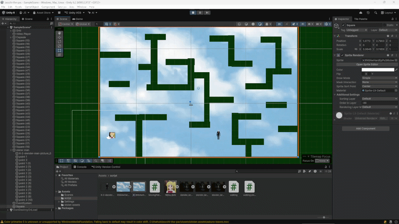

# horror stalker bocchi the vocaloid pacman without glasses -5 while your a alcoholic getting drunker every minute

--------------------------------------------------------------------------------------

# 10:30 10-02-2026

ok dus onze game idea is like pacman maar dan ipv pacman en powerups zijn het mensen uit btw (bocchi the rock) en like ipv de ghosts zijn het vocaloids en die gaan achter je aan en de powerops zijn specefiek kesuko band members omdat ja

-----------------------------------------------------------------------------------------

# 10:39 10-02-2025

ok dus dit is wat wie gaat doen

Jakub  | Blue
------------- | -------------
Map  | Beer Bottle script
Movement Script  | Pathfinding
Score script  | ui

--------------------------------------------------------------------------------------

# 10:44 17-02-2026

dus dit is onze map ik hoop dat jullie het ok vinden, cheers.

--------------------------------------------------------------------------------------

# 11:57 02-03-2026

yo blue vond de map te groot dus dit is de nieuwe map gang </3

--------------------------------------------------------------------------------------

# 12:09 03-03-2026

movmenent en de enemy is er en like de path ding ook idk blue is ziek help ik doe alles maar het is ook well ok kijk maar naar wat we hebben
ik heb ook coden hergebruikt :)

--------------------------------------------------------------------------------------

# 10:01 10-03-2026

# het idee
je bent nijika uit bocchi the rock™
je moet 20 bier flessen pakken die notes hebben aan hun voor dat slener man je pakt.
slener man weet de hele tijd waar je bent maar hij is sloomer dan jij dus dat is geen probleem
als je alle notes hebt kan je terug naar de train station en dan kan je terug naar huis.

1. Hoe communiceer ik dat de speler kan bewegen?
   text op de scherm
   
2. Hoe communiceer ik wat het doel van het level is?
   dat staat well op de eerste note

3. Hoe communiceer ik wat gevaarlijk is?
   iedereen kent slenderman dat ik hoef niks uit te leggen

De vijand is: slender man die je volgt en je hoort em als hij dicht bij is door de static en en stappen van zijn feet. 
